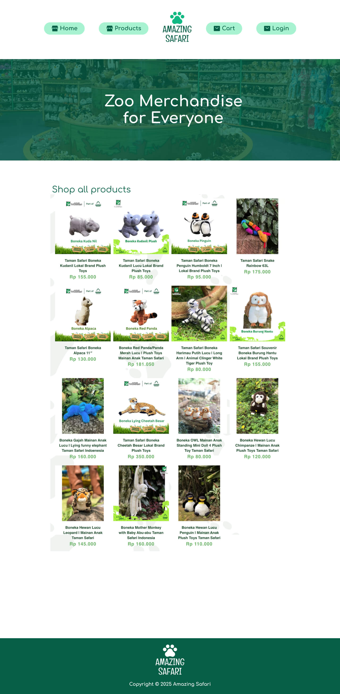
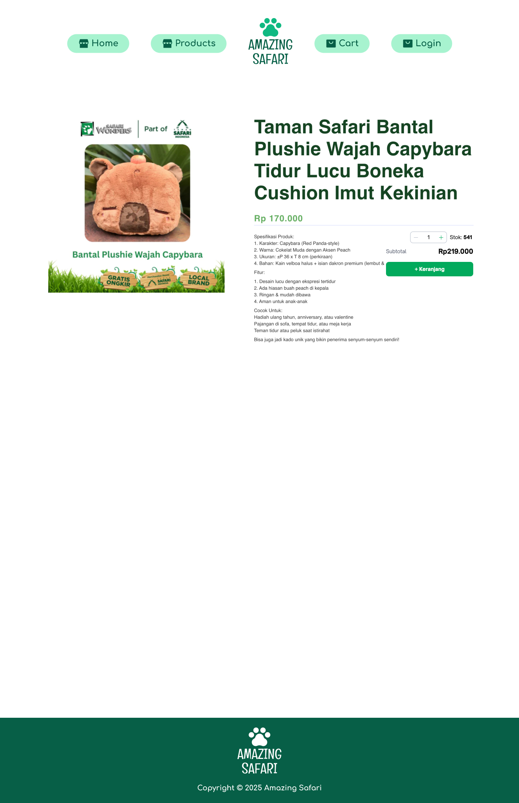

# Amazing Safari (Batch 10)

[Amazing Safari](https://amazingsafari-10.haidar.dev) online store for animal-themed merchandise.

## Links

- Website/Frontend: <https://amazingsafari-10.haidar.dev>
  - Backend API: <https://amazingsafari-api-10.haidar.dev>
- Repositories:
  - General: <https://github.com/mhaidarhanif/amazingsafari-10>
  - Backend API: <https://github.com/mhaidarhanif/amazingsafari-api-10>
  - Frontend Web: <https://github.com/mhaidarhanif/amazingsafari-web-10>
- Project Management: <https://linear.app/amazingsafari-10>

Inspirations:

- <https://shop.mandai.com> - Singapore's premier nature destination housing five world-class wildlife parks

## Features

- Home page
  - Hero section
  - Products catalogue. Example: <https://shop.mandai.com/collections/plush-pillow>
- Product page
  - Image URL
  - SKU (stock keeping unit)
  - Name
  - Price
  - Description
  - Stock level / In stock or not
  - Add to Cart Form:
    - Quantity Input
    - Increment & Decrement Button
    - Add to Cart Submit Button
- Shopping Cart page
  - Product items to buy
    - Image, name, price, quantity, subtotal (price x quantity)
    - Remove item
    - Change quantity form
  - Link: continue shopping, go to products catalogue
  - Link: checkout
- Checkout page
  - Order summary
    - Product items to buy
    - Grand total of all product items to buy
- Place order / transaction is being processed

## UI Designs

- Figma: <https://www.figma.com/design/TC8pwzy5HpWoFAQWJpN6IJ/amazingsafari.haidar.dev>

### Home Page



### Product by Slug



## Backend REST API Endpoints

- Production: `https://amazingsafari-10.haidar.dev`
- Local: `http://localhost:3000`

Priority:

| Endpoint           | HTTP  | Description         | Permission |
| ------------------ | ----- | ------------------- | ---------- |
| `/products`        | `GET` | Get all products    | Public     |
| `/products/{slug}` | `GET` | Get product by slug | Public     |

With Auth:

| Endpoint         | HTTP   | Description              | Permission    |
| ---------------- | ------ | ------------------------ | ------------- |
| `/users`         | `GET`  | Get all users            | Public        |
| `/users/{id}`    | `GET`  | Get user by id           | Public        |
| `/auth/register` | `POST` | Register new user        | Public        |
| `/auth/login`    | `POST` | Login user               | Public        |
| `/auth/me`       | `GET`  | Check authenticated user | Authenticated |
| `/auth/logout`   | `POST` | Logout user              | Authenticated |

Cart:

| Endpoint           | HTTP     | Description                    | Permission    |
| ------------------ | -------- | ------------------------------ | ------------- |
| `/cart`            | `GET`    | Get user's cart                | Authenticated |
| `/cart/items`      | `PUT`    | Add product & quantity to cart | Authenticated |
| `/cart/items/{id}` | `DELETE` | Delete product from cart       | Authenticated |
| `/cart/items/{id}` | `PATCH`  | Update product quantity        | Authenticated |

## Frontend Pages

Priority:

| Route             | Title                    |
| ----------------- | ------------------------ |
| `/`               | Home Page                |
| `/products`       | All Products Page        |
| `/products/:slug` | One Product by Slug Page |

With Auth:

| Route        | Title                   | Permission    |
| ------------ | ----------------------- | ------------- |
| `/register`  | Register Page           | Public        |
| `/login`     | Login Page              | Public        |
| `/dashboard` | Authenticated User Page | Authenticated |
| `/logout`    | Logout Page             | Authenticated |
| `/cart`      | Cart Page               | Authenticated |

## Data Structure

### Product

```json
{
  "id": "ULID123",
  "slug": "panda-plush",
  "name": "Panda Plush",
  "sku": "AZ-PANDA-1",
  "price": 120000,
  "stockQuantity": 10,
  "imageUrl": "https://uploadcare.com/images/image.jpg",
  "createdAt": "...",
  "updatedAt": "..."
}
```

### Add New Product

Request Body:

```json
{
  "name": "Tiger Plush",
  "price": 150000,
  "sku": "AZ-TIGER-1",
  "stockQuantity": 10
}
```

Response Body:

```json
{
  "id": "ULID123",
  "slug": "tiger-plush",
  "name": "Tiger Plush",
  "price": 150000,
  "sku": "AZ-TIGER-1",
  "stockQuantity": 10
}
```
